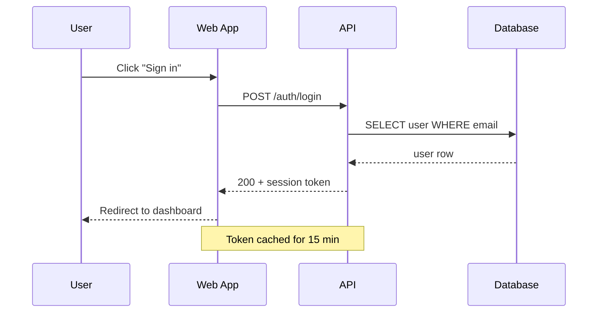
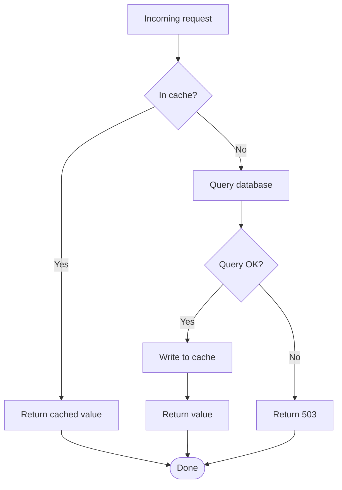
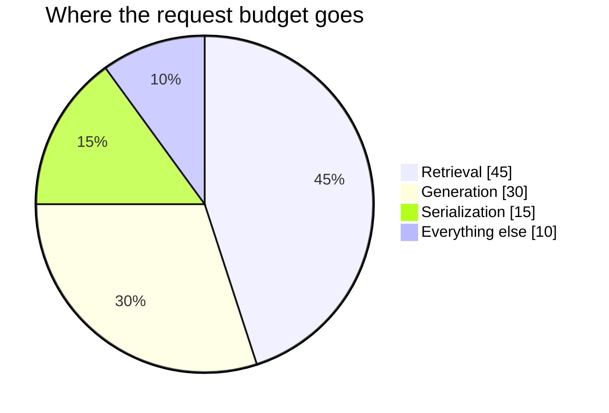

## Why Diagrams as Code

Screenshots of diagrams rot. The source lives in some other tool, the export drifts out of date, and six months later nobody can edit the thing. Writing diagrams as code keeps them in the post, in version control, and diffable like everything else.

This site now renders [Mermaid](https://mermaid.js.org/) directly from fenced code blocks. Drop a ` ```mermaid ` block into any post and it renders inline, themed to match the rest of the site. Here are the three diagram types I reach for most.

## Sequence Diagram

Sequence diagrams are unbeatable for showing how parts of a system talk to each other over time — request flows, auth handshakes, retries.



The arrows carry meaning: `->>` is a call, `-->>` is a response. That tiny distinction makes the diagram readable at a glance.

## Flowchart

When the story is about decisions and branches rather than time, a flowchart is the right tool. Here's a request hitting a cache:



`TD` means top-down; swap it for `LR` to lay the same graph out left-to-right when it gets wide.

## Pie Chart

For a quick proportional breakdown — where time or traffic actually goes — a pie chart says it in one glance.



## How It Works

Each fenced ` ```mermaid ` block is intercepted in the markdown renderer and handed to a small `<Mermaid>` component, which calls `mermaid.render()` and drops the resulting SVG into the page. The theme variables are wired to the same orange-on-near-black palette as the rest of the site, so diagrams never look bolted on.

That's the whole point of diagrams as code: write once, in plain text, and let the page worry about how they look.
