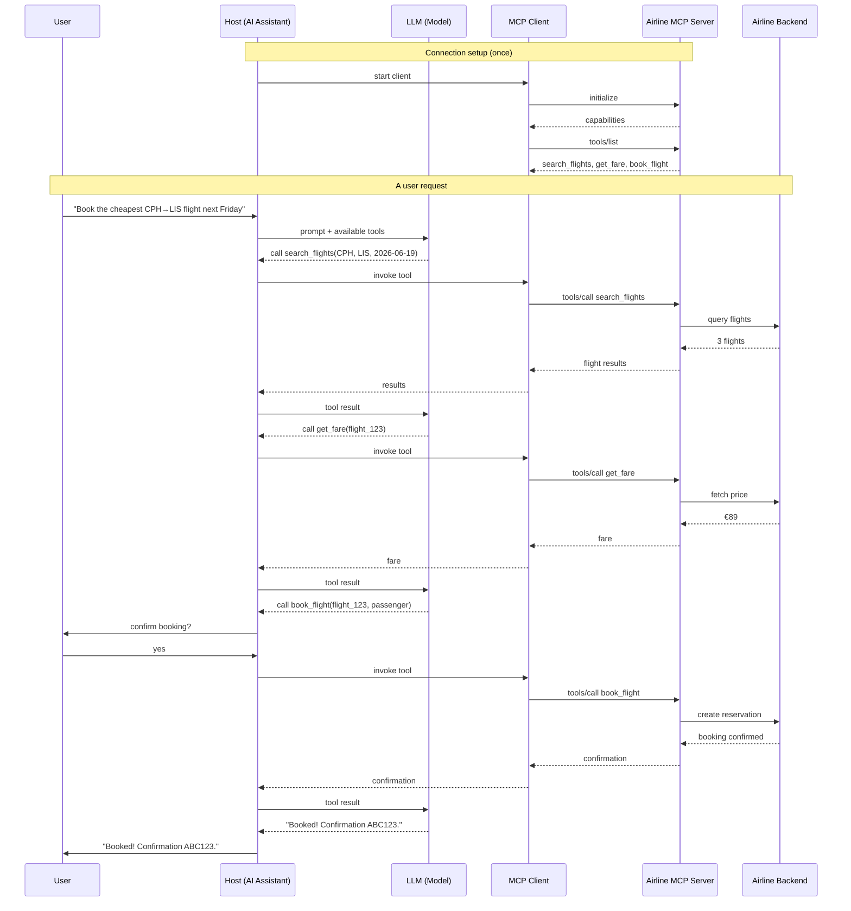

## What is MCP?

The **Model Context Protocol (MCP)** is an open standard that lets AI applications talk to external tools and data in a consistent way. Think of it like USB-C for LLMs: instead of writing a custom integration for every tool, you build one MCP server and any MCP-aware app can use it.

There are three roles to keep in mind:

- **Host** — the AI app the user interacts with (a chat client, an IDE, an assistant).
- **Client** — the connector inside the host that speaks MCP. One client per server connection.
- **Server** — the program that exposes capabilities: **tools** (actions), **resources** (readable data), and **prompts** (reusable templates).

The model never calls a server directly. The host orchestrates everything, and the model only decides *which* tool to call and *with what arguments*.

## The airline example

Imagine an airline ships an **Airline MCP server** that exposes three tools:

- `search_flights(origin, destination, date)` — find available flights
- `get_fare(flight_id)` — get the current price
- `book_flight(flight_id, passenger)` — reserve a seat

A traveler opens their AI assistant and types:

> "Find me a flight from Copenhagen to Lisbon next Friday and book the cheapest one."

Here's what happens under the hood.

## The full flow

## Walking through it

**1. Setup (happens once).** When the host starts, the client connects to the server and runs an `initialize` handshake. The server reports what it can do, and the client asks for the tool list. Now the host knows three tools exist and what arguments they take.

**2. The model decides.** The user's message and the tool definitions go to the model. The model doesn't run anything — it just responds "I want to call `search_flights` with these arguments." The host carries out that intent through the client.

**3. Tool calls loop.** Each result goes back to the model, which decides the next step: search, then check the fare, then book. This loop continues until the model has enough to answer.

**4. Humans stay in control.** Notice the `book_flight` step pauses for confirmation. Reads (searching, pricing) can run freely, but an action that spends money or changes state should ask the user first. MCP makes this easy because the host sees every tool call before it executes.

## Why this matters

The airline wrote **one** server. It works in any MCP host — a desktop assistant, a customer-support bot, a travel-planning agent — without the airline knowing or caring which one. And the AI app added flight booking without writing airline-specific code; it just connected to another MCP server.

That decoupling — tools on one side, models on the other, a shared protocol in between — is the whole point of MCP.
